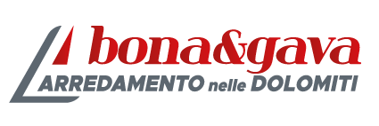

  

# Sito Bona&Gava Arredamenti
Sito web sviluppato per il progetto del corso di Tecnologie Web 2021-22, dell'Università di Padova.

# Obiettivi
Il sito è stato sviluppato per un impiego reale massimizzando i parametri di accessibilità e SEO. 
Il team ha seguito al massimo gli standard del [W3C](https://www.w3.org) e in particolare del [WCAG](https://www.w3.org/WAI/standards-guidelines/wcag/) per l'accessibilità.
L'interfaccia è completamente responsive e scalabile per qualsiasi tipo di dispositivo. Il layout di stampa è stato inoltre integrato.

# Tecnologie
L'intero sito è stato creato adottando le più moderne tecnologie di sviluppo web:
- 
- 
- 
- 

# Il team

- [Matteo Noro](https://github.com/TheoMadCo)
- [Giovanni Cocco](https://github.com/iota97)
- [Luca Busacca](https://github.com/LuBu-0)
- [Marco Bustaffa](https://github.com/Mallow00)
